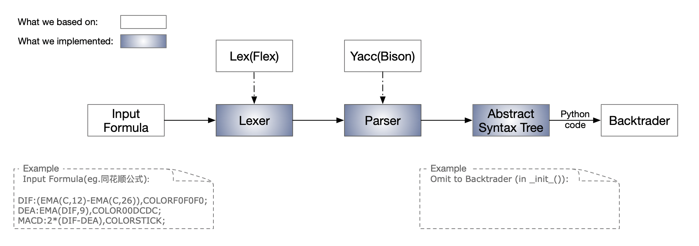

# TA-FormulaParser

(Ongoing) A Stock Technical Analysis Formula Parser for Backtesting.

Implement the analysis, transformation and backtesting of formulas written based on traditional technical analyze indicators.  
Allows more convenient inheritance and understanding of traditional technical analysis ideas, furthurmore, combined with the rigorous logic of modern quantitative investment.



## Quickstart

1. Compile

```shell
>yacc hithinkFlush_formula.y -d -t -v
>lex hithinkFlush_formula.l
>cc y.tab.c -DYYDEBUG=1
>echo "DIF:=(EMA(C,12)-EMA(C,26)),COLORF0F0F0;" | ./a.out
```

## Reference

Flex: Lexical analyzer generator  
GNU Bison: Yacc-compatible parser generator  
Backtrader: A feature-rich Python framework for backtesting and trading
